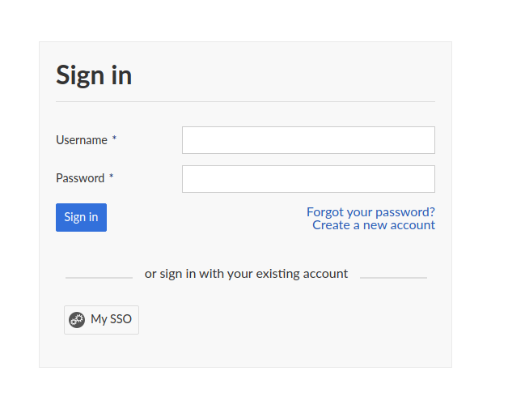

---
sidebar_navigation:
  title: SAML single sign-on
  priority: 800
description: How to set up SAML integration for SSO with OpenProject.
robots: index, follow
keywords: SAML, SSO, single sign-on, authentication
---
# SAML

<div class="alert alert-info" role="alert">
**Note**: This documentation is valid for the OpenProject Enterprise Edition only.
</div>

You can integrate your active directory or other SAML compliant identity provider in your OpenProject Enterprise Edition.

### 1: Configuring the SAML integration

The configuration can be provided in one of three ways:

* `configuration.yml` file (1.1)
* Environment variables (1.2)
* `settings.yml` file (1.3)

Whatever means are chosen, the plugin simply passes all options to omniauth-saml. See [their configuration
documentation](https://github.com/omniauth/omniauth-saml#usage) for further details.

The three options are mutually exclusive. I.e. if settings are already provided via the `configuration.yml` file, settings in a `settings.yml` file will be ignored. Environment variables will override the `configuration.yml` based configuration, though.

#### 1.1 configuration.yml file

In your OpenProject packaged installation, you can modify the `/opt/openproject/config/configuration.yml` file. This will contains the complete OpenProject configuration and can be extended to also contain metadata settings and connection details for your SSO identity provider.

Everything belonging to the `saml` key will be made available to the plugin.

```yaml
production:
  # <-- other configuration -->

  saml:
    name: "saml"
    display_name: "My SSO"
    # Use the default SAML icon
    icon: "auth_provider-saml.png"

    # omniauth-saml config
    assertion_consumer_service_url: "https:/<YOUR OPENPROJECT HOSTNAME>/auth/saml/callback"
    issuer: "https://<YOUR OPENPROJECT HOSTNAME>"

    # IF your SSL certificate on your SSO is not trusted on this machine, you need to add it here
    #idp_cert: "-----BEGIN CERTIFICATE-----\n ..... SSL CERTIFICATE HERE ...-----END CERTIFICATE-----\n"
    # Otherwise, the certificate fingerprint must be added
    # Either `idp_cert` or `idp_cert_fingerprint` must be present!
    idp_cert_fingerprint: "E7:91:B2:E1:...",

    # Replace with your single sign on URL
    # For example: "https://sso.example.com/saml/singleSignOn"
    idp_sso_target_url: "<YOUR SSO URL>"
    # Replace with your single sign out URL
    # or comment out
    # For example: "https://sso.example.com/saml/proxySingleLogout"
    idp_slo_target_url: "<YOUR SSO logout URL>"

    # Attribute map in SAML
    attribute_statements:
      # What attribute in SAML maps to email (default: mail)
      email: ['mail']
      # What attribute in SAML maps to the user login (default: uid)
      login: ['uid']
      # What attribute in SAML maps to the first name (default: givenName)
      first_name: ['givenName']
      # What attribute in SAML maps to the last name (default: sn)
      last_name: ['sn']

  # <-- other configuration -->
```

Be sure to choose the correct indentation and base key. The `saml` key should be indented two spaces (and all other keys accordingly) and the configuration should belong to the `production` group.

#### 1.2 Environment variables

As with all the rest of the OpenProject configuration settings, the SAML configuration can be provided via environment variables.

E.g.

```bash
OPENPROJECT_SAML_MY__SAML_NAME="your-provider-name"
OPENPROJECT_SAML_MY__SAML_DISPLAY__NAME="My SAML provider"
...
OPENPROJECT_SAML_MY__SAML_ATTRIBUTE__STATEMENTS_ADMIN="['openproject-isadmin']"
```

Please note that every underscore (`_`) in the original configuration key has to be replaced by a duplicate underscore
(`__`) in the environment variable as the single underscore denotes namespaces.

#### 1.3 settings.yml file

In your OpenProject packaged installation, add the `/opt/openproject/config/plugins/auth_saml/settings.yml` file. This will contain metadata settings and connection details for your SSO identity provider.

The structure and options are the same compared to having the options as environment variables or in the configuration.yml file

```yaml
saml:
  name: "saml"
  display_name: "My SSO"
  <-- omitted for brevity
```

<div class="alert alert-info" role="alert">
**Note**: Providing the configuration via the `settings.yml` is deprecated.
</div>

### 2: Restarting the server

Once the configuration is completed, restart your OpenProject server with `service openproject restart`. 

### 3: Logging in

From there on, you will see a button dedicated to logging in via SAML, e.g named "My SSO" (depending on the name you chose in the configuration), when logging in. Clicking it will redirect to your SSO provider and return with your attribute data to set up the account, or to log in.




## Troubleshooting

Q: After clicking on a provider badge, I am redirected to a signup form that says a user already exists with that login.

A: This can happen if you previously created user accounts in OpenProject with the same email than what is stored in the identity provider. In this case, if you want to allow existing users to be automatically remapped to the SAML identity provider, you should do the following:

```
sudo openproject run console
> Setting.oauth_allow_remapping_of_existing_users = true
> exit
```

Then, existing users should be able to log in using their SAML identity. Note that this works only if the user is using password-based authentication, and is not linked to any other authentication source (e.g. LDAP) or OpenID provider.