---
sidebar_navigation:
  title: Agile Boards
  priority: 860
description: How to get started with agile Boards for Kanban, Scrum and Agile Project Management.
robots: index, follow
keywords: agile boards, Kanban, Scrum, agile project management
---

# Boards for Agile Project Management (Premium feature)

Boards support agile project management methodologies, such as Scrum or Kanban.

Boards can be for anything you would like to keep track of within your projects: Tasks to be done, Bugs to be fixed, Things to be reviewed,  Features to be developed, Risks to be monitored, Ideas to be spread,  anything!

**Note**: OpenProject Boards is a Premium Feature and can only be used with the [Cloud Edition]( ../../cloud-edition-guide/) or OpenProject [Enterprise Edition](../../enterprise-edition-guide/). And upgrade from the free Community Edition to the Cloud or Enterprise Edition is easily possible.

| Feature                                                      | Documentation for                                            |
| ------------------------------------------------------------ | ------------------------------------------------------------ |
| [Create new Boards](#create-a-new-board)                     | How to create new agile board.                               |
| [Basic board and Action board](#basic-board-and-action-board) | What is the difference between Basic boards and Action boards. |
| [Give the board a title](#give-the-board-a-title)            | How to name a board.                                         |
| [Add lists to your board](#add-lists-to-your-board)          | How to add lists to a board.                                 |
| [Remove lists](#remove-lists)                                | How to remove lists from a board.                            |
| [Add cards to a list](#add-cards-to-a-list)                  | How to add cards to a list in a board.                       |
| [Update cards](#update-cards)                                | How to update cards.                                         |
| [Remove cards](#remove-cards)                                | How to remove cards.                                         |
| [Manage boards](#manage-boards)                              | How to manage permissions for boards.                        |

<iframe width="560" height="315" src="https://www.youtube.com/embed/Z7iE_BNCDus" frameborder="0" allow="accelerometer; autoplay; encrypted-media; gyroscope; picture-in-picture" allowfullscreen></iframe>
## Agile Boards in OpenProject

The new Boards are tightly integrated with all other project management functionalities in OpenProject, i.e. [work packages](#work-pages) or [Gantt charts](#gantt-charts).  This makes it so easy and practical to include the Boards in your daily  project management routines and to gain a much quicker overview of  important topics in your project.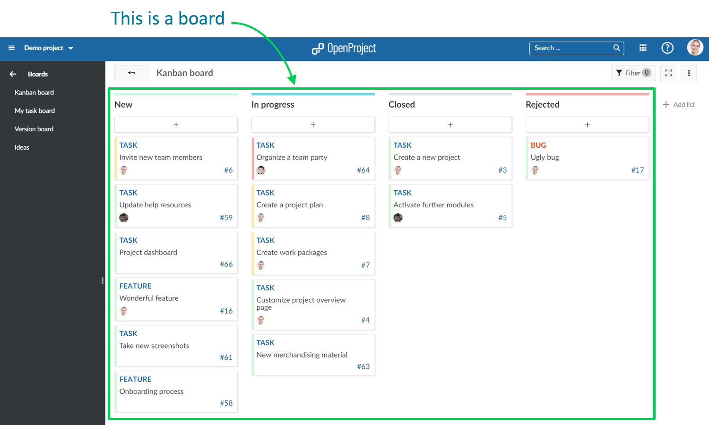 

## Create a new Board

You can create as many flexible boards in a project as you need and  configure them to your needs. First, you need to create a new Boards  view. 
If you haven't done so yet, [activate the Boards module](../projects/project-settings/modules) within your project. Also, we recommend to verify [Roles and Permissions](https://www.openproject.org/help/administration/manage-roles-permissions/) within your system's Administration.

Click on the green **+Board** button to create a new Board view. 

## Choose between Basic board and Action board

Next, you need to choose if you want to create a Basic board or an Action board.

**Basic board**: You can freely create lists, name them  and order your work packages within. If you move work packages between  the lists, there will be **NO changes** to the work package  itself. This allows you to create flexible boards for any kind of  activity you would like to track, e.g. Management of Ideas.

**Action board**: Create boards with filtered lists on a single attribute, e.g. Status. Moving work packages between the lists will update the attribute, e.g. Status. You can choose between Action boards for **Status** or **Versions**. More to be added soon.

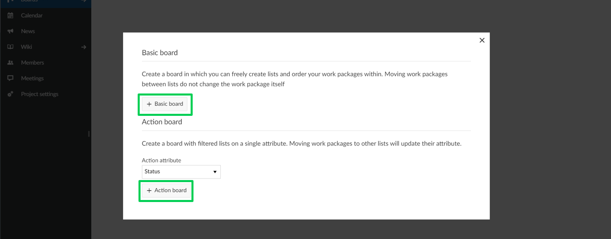

## Give the board a title

Choose a meaningful title for your Board so that it is clear, e.g. for other team members, what you want to do.

 

## Add lists to your board

**Lists** usually represent a **status workflow**, a **version**, or **anything** that you would like to track within your project. You can add as many lists that you need to a Board.

**Action boards lists**: can be for Status, Versions, and more to come. Remember: if you change a card between the lists, the respective attribute (e.g. Status) will be updated automatically.
**Basic board lists**:  you can create any kind of list and name them to your needs. Remember:  no updates to the attributes will happen when moving cards between the  lists.

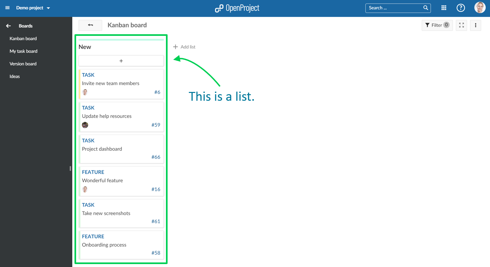

  

Click **+ add list** to add lists to your board.

 

**Action board lists**: choose an attribute which the list shall represent, e.g. Status "In specification".
**Basic board lists**: give the list any meaningful name.

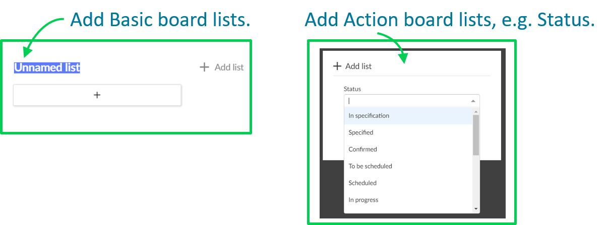 

## Remove lists

To remove lists, click on the three dots next to a list's title, and select **Delete list**. 

## Add cards to a list

You can add cards to a list. Cards represent a [work package](https://docs.openproject.org/user-guide/work-packages/) in OpenProject. They can be any kind of work within a project, e.g. a Task, a Bug, a Feature, a Risk, anything.

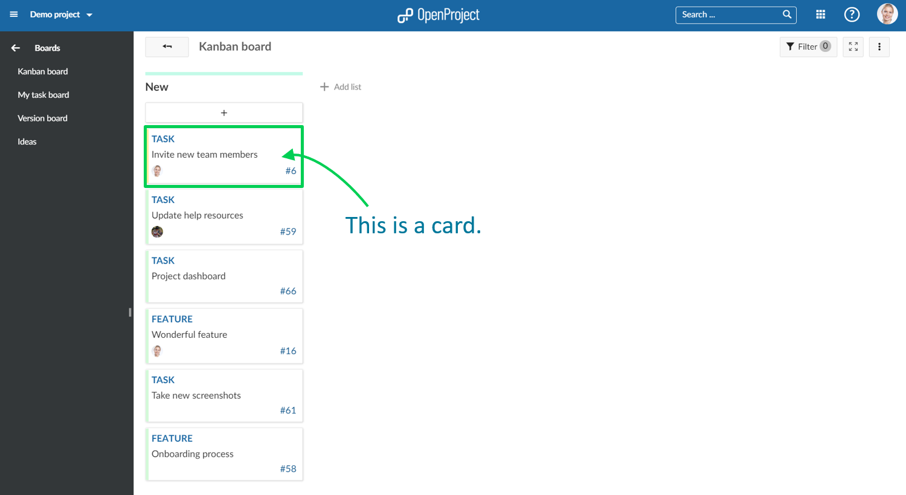 

Click **+** under the lists' title to add a card: create a new card or choose an existing work package and add it as a card to your list.

 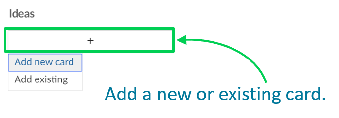

**Add new card**: enter a title and click Enter.
**Add existing**: enter an existing title or an ID and click Enter.

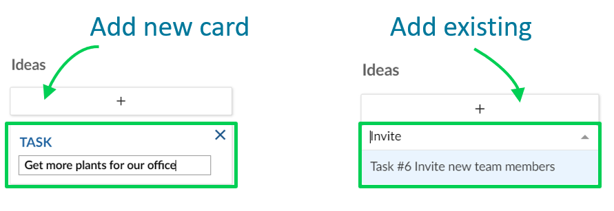

## Update cards

You can update cards in the following ways:

**Move cards with drag and drop** within a list or to a new list. Remember: moving cards to another list in an Action board will update their attributes, e.g. Status.

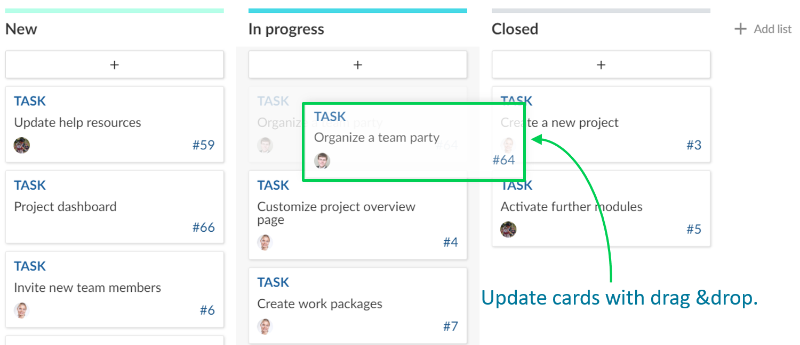 

**Update status** in a Basic board directly in the card.

 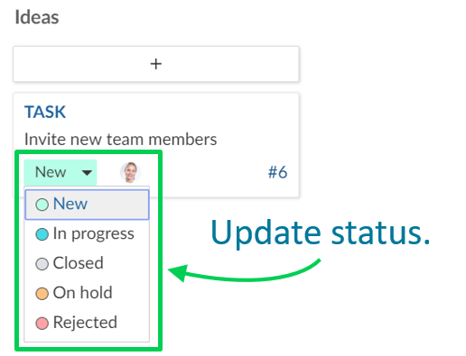

A **double click on a card** will open the **details view.** The **arrow** on top will bring you back to the boards view.

 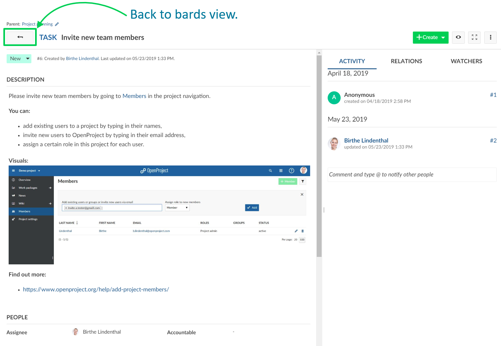

## Remove cards

To remove a card from a **Basic board** hover over the card and press the **X**.

 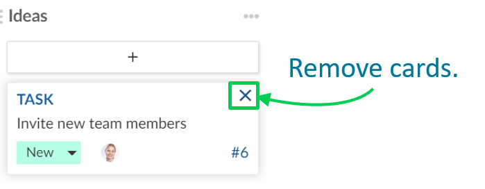

Cards from **Actions boards** will be removed automatically from a list as soon as the respective attribute (e.g. Status) is changed.

## Manage boards

To **create new** boards, **open existing** boards, or **delete** boards, navigate to the main Boards menu item.

 

Verify and **update roles and permissions for boards** in the system's Administration.

 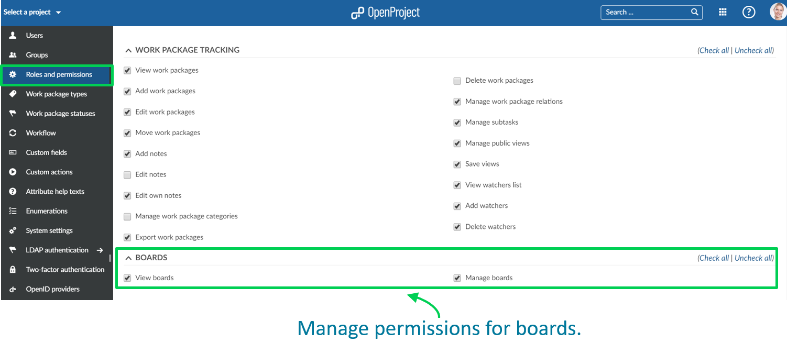
 
 
 ## Frequently asked questions (FAQ)
 
 
 ### How can I activate Boards in OpenProject? 
 
The boards module is a premium feature of the Enterprise And Cloud Edition. You can upgrade your Community Edition installation by entering a valid subscription token in the application administration. You can purchase the token on our [website](https://www.openproject.org/enterprise-edition/).
In addition, you need to activate the boards module in the project settings.
