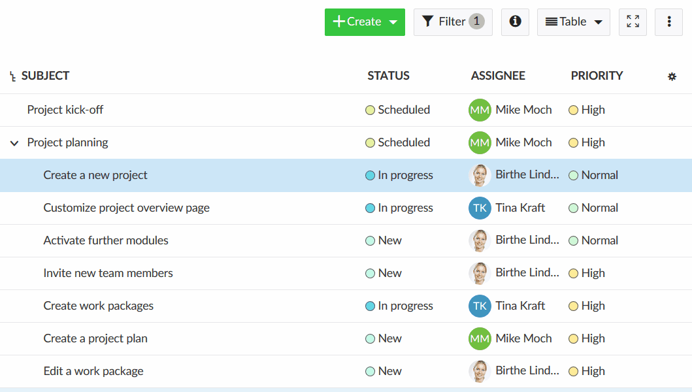
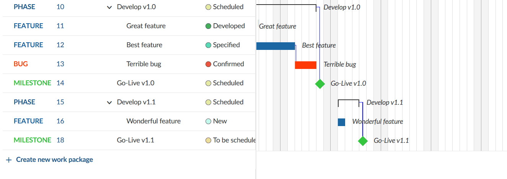
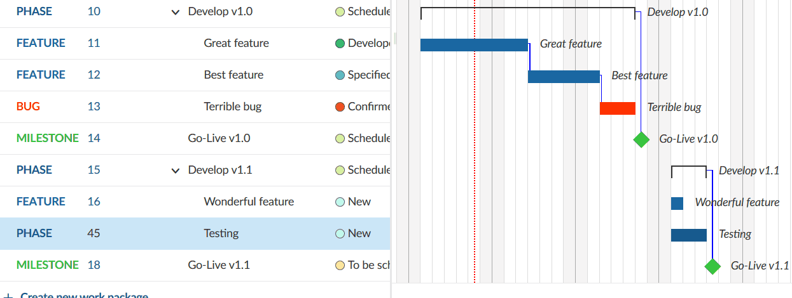
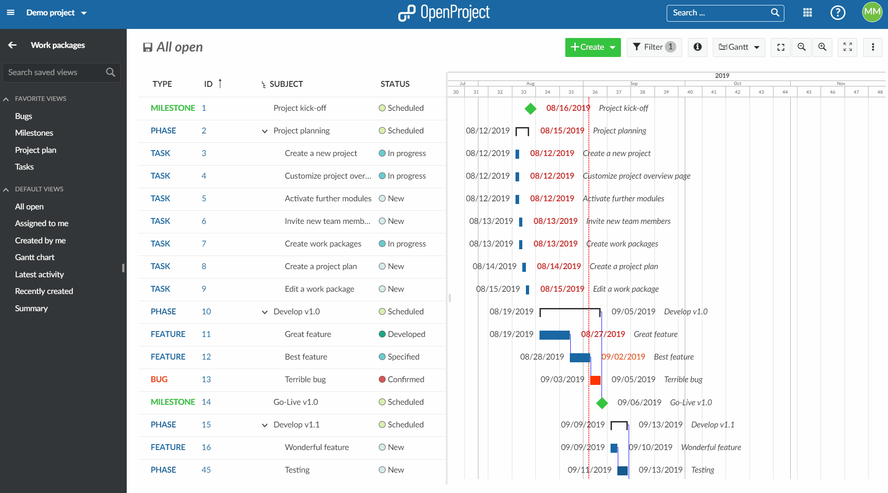
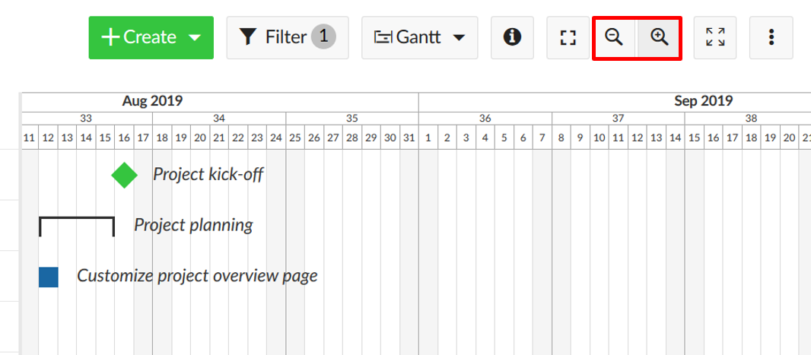
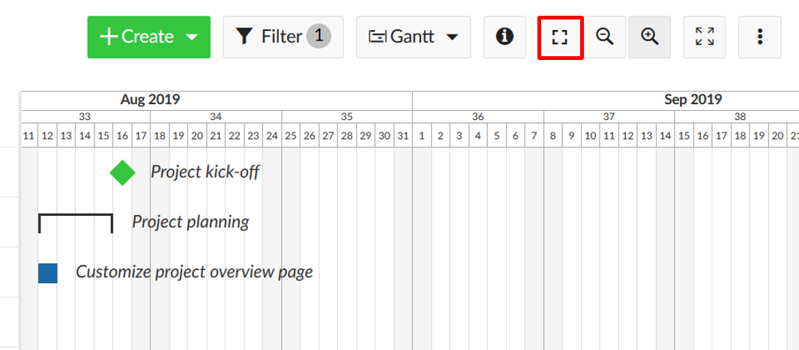

---
sidebar_navigation:
  title: Gantt charts
  priority: 865
description: Create project timelines with Gantt charts in OpenProject
robots: index, follow
keywords: gantt chart, timeline, project plan
---

# Gantt charts

The **Gantt chart** in OpenProject displays the work packages in a timeline. You can collaboratively create and manage your project plan. Have your project timelines available for all team members and share up-to-date information with stakeholders. You can add start and finish date and adapt it with drag and drop in the Gantt chart. Also, you can add dependencies, predecessor or follower within the Gantt chart.

| Feature                                                      | Documentation for                                            |
| ------------------------------------------------------------ | ------------------------------------------------------------ |
| [Activate the Gantt chart](#activate-the-gantt-chart)        | How to activate the Gantt chart in OpenProject?              |
| [Create a new element](#create-a-new-element-in-the-gantt-chart) | How to add a new item to the Gantt chart?                    |
| [Relations in the Gantt chart](#relations-in-the-gantt-chart) | Create and display dependencies in the Gantt chart.          |
| [Gantt chart configuration](#gantt-chart-configuration)      | How to configure the view of your Gantt chart, e.g. add labels? |
| [Synchronize data from OpenProject to Excel](#synchronize-data-from-openproject-to-excel) | How to synchronize data from OpenProject to Excel?           |
| [Gantt chart views](#gantt-chart-views)                      | How to zoom in and out and activate the Zen mode?            |

<iframe width="560" height="315" src="https://www.youtube.com/embed/JNRmqWwSfeU" frameborder="0" allow="accelerometer; autoplay; encrypted-media; gyroscope; picture-in-picture" allowfullscreen></iframe>

## Activate the Gantt chart

A Gantt chart can be activated in any work package list, to display the work packages in a timeline view.

To activate the Gantt chart, select the **Gantt** icon at the top right of the work package list.

## Create a new element in the Gantt chart

To add a work package (e.g. phase, milestone or task) to a Gantt chart, click the **+ Create new work package** link at the bottom of the work package list view.

You can add a subject and make changes to type, status or more fields.

In the **Gantt chart** you can schedule the work package with drag and drop and change the duration.

### How to change the order of an item in the Gantt chart?

To change the order the elements in the Gantt chart. Click the **drag and drop** icon at the left hand side of the work package row. Drag the item to the new position. The blue line indicated the new position to drop the element.

### How to change the duration of an element in the Gantt chart?

To change the duration of a phase in the Gantt chart view, click on the element in the Gantt chart. You can change the duration with drag and drop, shorten or prolong the duration and change start and due date.

## Relations in the Gantt chart

In the Gantt chart you can track dependencies of work packages (e.g. phases, milestones, tasks). This way you can get an easy overview of what needs to be done in which order, e.g. what tasks need to be completed to achieve a milestone.

To add a dependency make right mouse click on an element in the Gantt chart.

In the menu, choose **Add predecessor** or **Add follower**.

Select the item which you want to create the dependency with. The precede and follow relation is marked with a small blue line in the Gantt chart.

OpenProject does not yet include a baseline feature to compare scheduled versions. However, we are aware of the need for it and documented it. Please check [here](https://community.openproject.com/projects/openproject/work_packages/26448/activity) for an update.

To find out about **how work packages behave**, when you move their predecessor or follower or change the date of a child work package please read our guide for the [Automatic and manual scheduling mode](/scheduling).

## Gantt chart configuration

To open the Gantt chart configuration, please open the **settings** icon with the three dots on the top right of the work package module.
Choose **Configure view ...** and select the tab **Gantt chart**.

Here you can **adapt the Zoom level**, or choose and Auto zoom which will select a Zoom level which best fits to your browser size to have optimal results on a page.

Also, you have **Label Configuration**  for your Gantt chart. You can add up to three additional labels within the chart: On the left, on the right and on the far right. Just select which additional information you would need to have in the Gantt chart. This can be especially relevant if you want to print your Gantt chart.

Click the **Apply** button to save your changes.()

### How to export data from a Gantt diagram?

To export the data from your Gantt chart there are several possibilities:

* [Export via the work package view](../work-packages/edit-work-package/#export-work-packages)
* [Print (e.g. to PDF)](#how-to-print-a-gantt-chart)
* [Synchronize data from OpenProject to Excel](#synchronize-data-from-OpenProject-to-Excel) <-> MS Project

### How to print a Gantt chart?

The Gantt chart can be printed via the browser's printing function. It is optimized for Chrome.

First, make sure to **add the labels** you will need in the Gantt chart, e.g. Start date, Finish date, Subject, in the [Gantt chart configuration](#gantt-chart-configuration).

Choose the **Auto zoom** by clicking on the Auto zoom button on top of the Gantt chart.

Optimize the screen by dragging the Gantt chart to the far left so that only the Gantt chart is seen.

Then, **press CTRL + P** to print the Gantt chart view.

Make sure you select **Landscape** as a print layout.

In the settings, enable the **Background graphics** for printing.

Press the **Print** button.

For other browsers, please simply follow the browser's printing instruction to optimize results.

## Synchronize data from OpenProject to Excel

You can synchronize your work packages data from OpenProject to Excel (and even convert from or to MS Project). You need to download an OpenProject plugin.

Follow our [Step by step guide how to synchronize your Excel Sheet with OpenProject](https://www.openproject.org/synchronize-excel-openproject/).

## Gantt chart views

### Zoom in the Gantt chart

To zoom in and zoom out in the Gantt chart view, click on the button with the **+** and **- icon** on top of the chart.

### Auto zoom

Select the **auto zoom button** on top of the Gantt chart to have the best view of your Gantt chart.

### Zen mode
