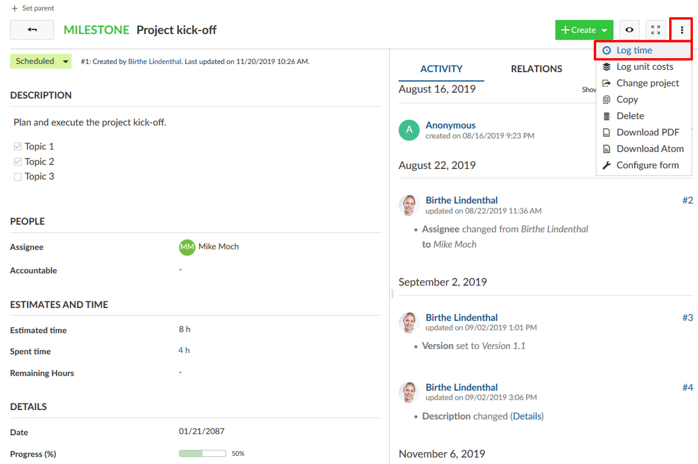
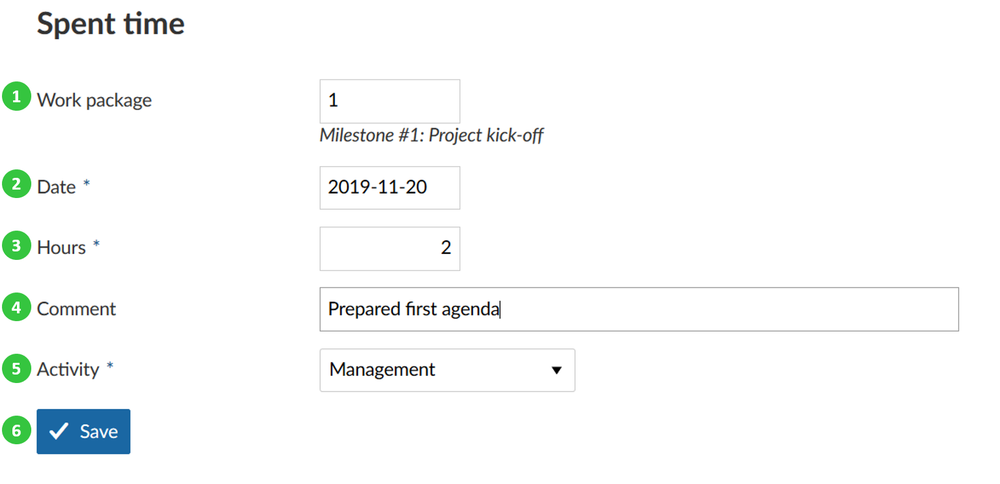
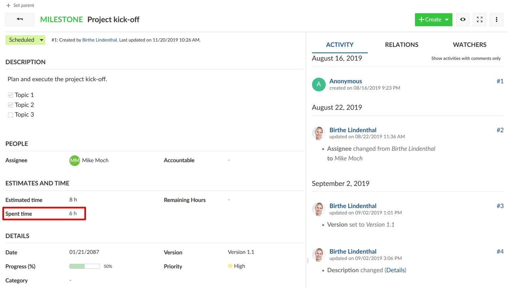
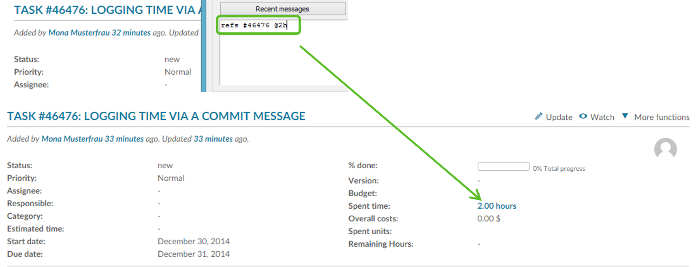
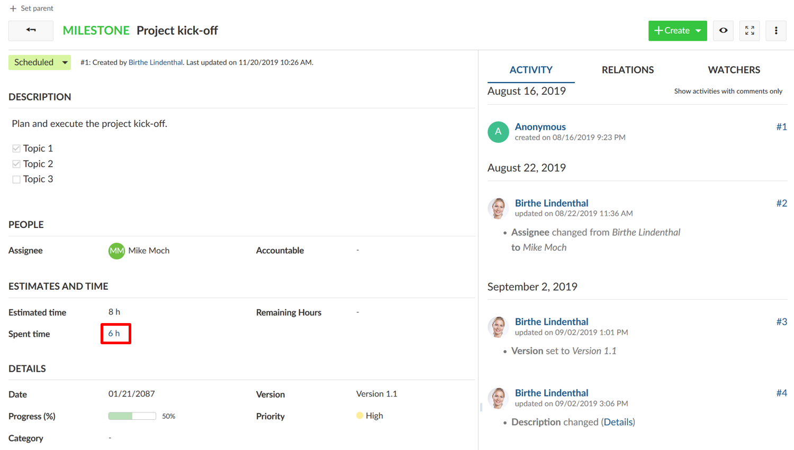
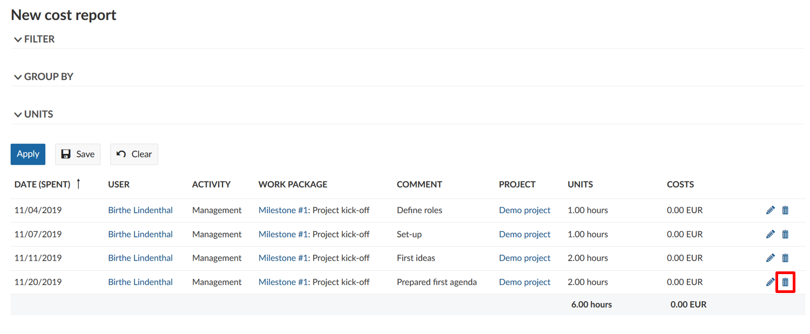
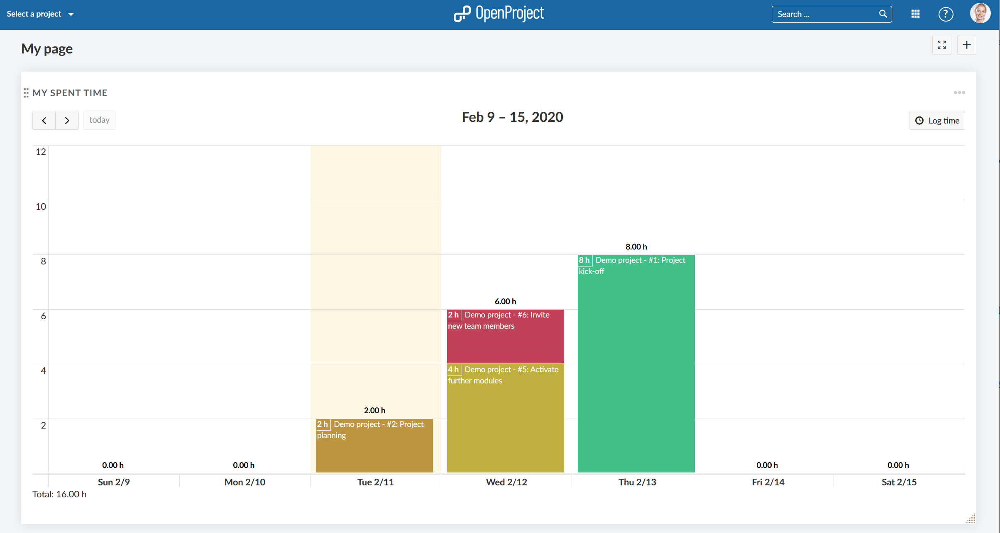

---
sidebar_navigation:
  title: Time tracking
  priority: 799
description: Time tracking in OpenProject
robots: index, follow
keywords: time tracking, logging time
---

# Time tracking

Users can book their time or units spent on an activity within a project directly on work packages,  which gives a clear indication of how much effort the project activities require. You can either log time in the work package view or via a commit message.

**Note**: When using the time tracking functionality, the **Time tracking module** needs to be activated in the [project menu](../../projects).

| Feature                                                      | Documentation for                                       |
| ------------------------------------------------------------ | ------------------------------------------------------- |
| [Logging time](#logging-time-in-the-work-package-view)       | How to log time to work packages?                       |
| [Logging time via commit message](#logging-time-via-a-commit message) | How to log time via a commit message to a work package? |
| [Edit logged time](#edit-logged-time)                        | How to edit logged time on a work package?              |
| [Delete time entries](#delte-time-entires)                   | how to delete time entries logged to a work package?    |

## Logging time in the work package view

In order to log spent hours for a certain activity, open the details of the corresponding work package. Select **Log time** from the **More functions** drop down menu, the icon with the three dots in the top right of the work packages details.

You will be directed to the detailed view to log time where you can edit the following:

1. The work package ID of the work package you want to log time on. The work package ID of the work package which you selected via the **Log time** option is shown automatically. If you change this ID, the spent time will be logged on the respective work package.
2. The date, for which the time will be logged.
3. The actually logged time (in hours).
4. The comment field, where you can note a more detailed description of the activities that you log time for.
5. The **Activity** drop down menu offers a choice of activity  categories, such as coordination or development. The range of categories can vary from project to project and can be edited by a project  administrator or a role with respective permissions.
6. Don’t forget to **Save** your logged time.

The aggregated time spent on a work package is shown in the work package details view.

## Logging time via a commit message

Note: the “enable time logging” option must be activated under system settings in order to log time via a commit message.

To log time to a work package via a commit message you need to use  the following syntax: Refs #Work package number @amount of hours. For  example refs #123 @2h will log 2 hours for the work package number 123.

## Edit logged time

To edit logged time, click in the amount of the **Spent time** in the work packages details view.

This will bring you to the time tracking report where you will see all time entries to this work package.

Click on the **Edit** icon next to a time entry in the list.

The same detailed view to log your time entries will appear where you are now able to apply your changes.

## Delete time entries

To delete a time entry, also click on the **Spent time** in the details of a work package (just as to edit a work package).

In the list of time entries, click on the **Delete** icon next to a time entry to drop the logged time.

## Track labor costs

In order to track labor costs, you need to [define an hourly rate](../cost-tracking/#hourly-rate) in your user profile first.

## Spent time widget on the My Page

You can easily track spent time in the spent time widget on the MyPage and get an overview about all your activities during a week.

The the information on the [MyPage](../../../getting-started/my-page) for further information.

