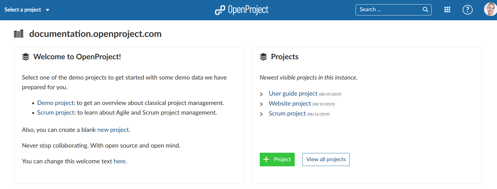
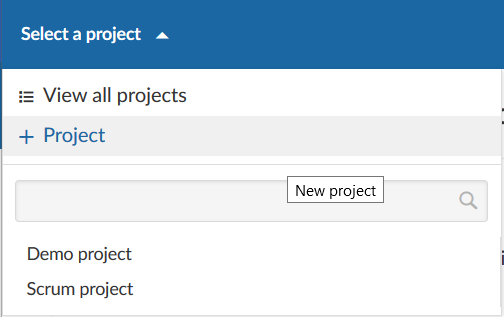
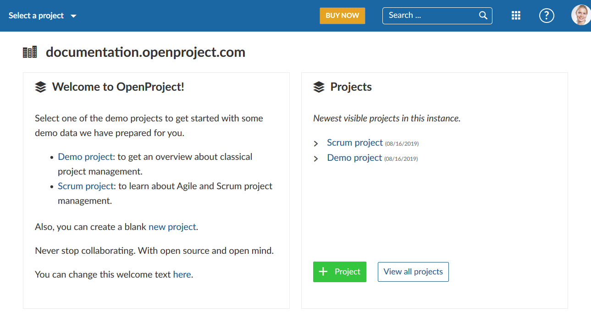

# Projects

To start collaboration in OpenProject, you first have to set up a new project.

| Feature                                               | Documentation for                                     |
| ----------------------------------------------------- | ----------------------------------------------------- |
| [Select a project](#open-an-existing-project)         | Open an existing project.                             |
| [Create a new project](#how-to-create-a-new project?) | How to create a new project?                          |
| [Advanced settings](#advanced-project-settings)       | Configure further advanced settings for your project. |

## Open an existing project

In order to open an existing project, click on the **Select a project** button on the top left corner of the header, and click the project which you want to open. You can also type in a project name to filter.

Also, you will see your newest projects on the application landing page in the **Projects** section. Here you can simply click on one of the newest visible projects to open it.

## How to create a new project?

To create a new project, click the **Select a project** button in the top left corner of the header and select **+ Project**.

Also, you can click the green button **+ Project** directly on the system's home screen in the **Project** section.

- Enter a **name** for your project and click the blue **Create** button.

### Advanced Project Settings

Optionally, you can find out how to configure further [advanced settings](./project-admin-guide/#project-settings) for your projects, e.g. description, project hierarchy or setting it to public.
