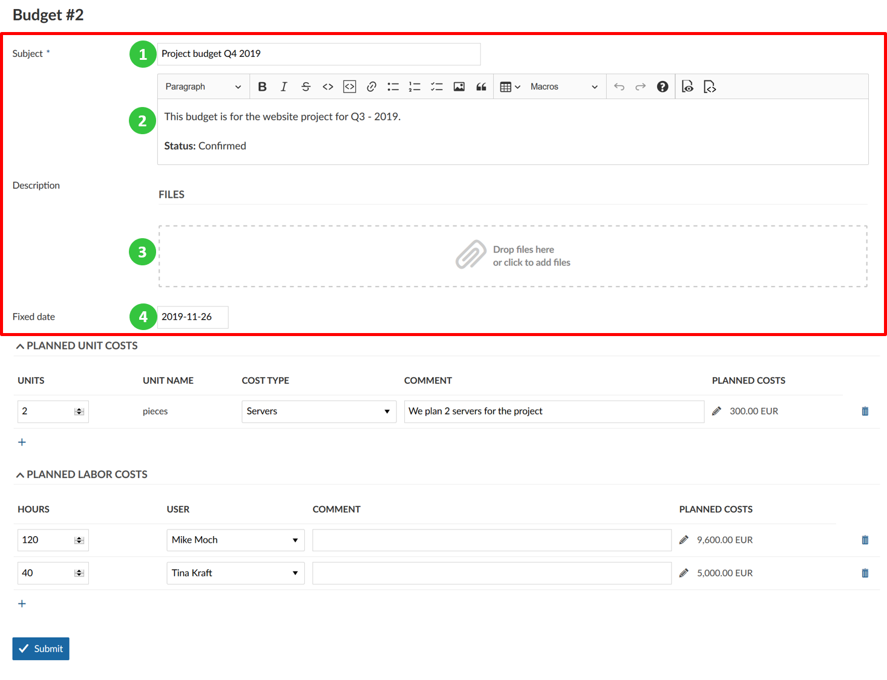

---
sidebar_navigation:
  title: Budgets
  priority: 790
description: Find out how to create and manage budgets for a project in OpenProject.
robots: index, follow
keywords: budgets
---

# Budgets

You can create and manage a **project budget** in OpenProject to keep track of your available and spent costs in a project.

You can add planned **unit costs** as well as **labor costs** for the project.

Then, you will assign work packages to a budgets. If you log time or costs to this work package the costs will booked to this budget and show the percentage spent for a project budget.

| Feature                                             | Documentation for                              |
| --------------------------------------------------- | ---------------------------------------------- |
| [Create a project budget](#create-a-project-budget) | How to set up a project budget in OpenProject? |
|                                                     |                                                |
|                                                     |                                                |
|                                                     |                                                |
|                                                     |                                                |

## Create a project budget

In order to create a budget in your project, the **Budgets module** needs to be activated in the [project settings](../../project-admin-guide).

To create your first budget in OpenProject, click the green **+ Budget** button on the top right of the page.

In the detailed view that will open you can enter the details for your project budget. As well as add planned unit costs and planned labor costs.

1. Enter a **subject** for your budget so you can identify it easily.
2. Enter a detailed **description** to add further information to your budget, e.g. budget owner, status and more.
3. Upload additional **files** to your budgets with drag and drop or by clicking on the field and choosing a file from the explorer.
4. Enter a **fixed date** if needed, this date will be taken for the budget to calculate the planned costs based on the [configured hourly rate](../time-and-costs/cost-tracking) in the user's profile. The hourly rate can be set for different date rages, therefore, if you set a fixed date for a budget, always the rate from this date will be taken.

