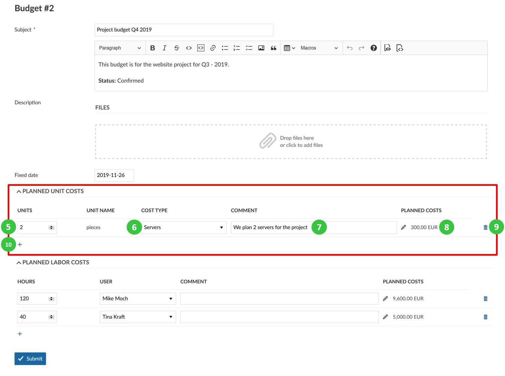
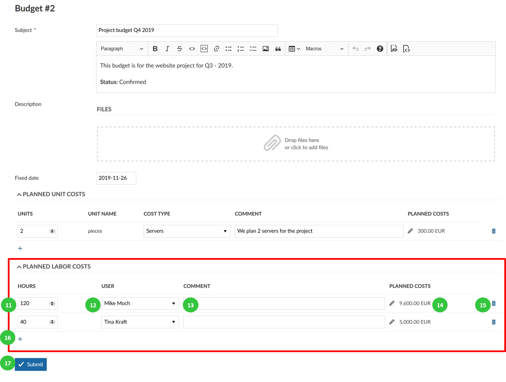

---
sidebar_navigation:
  title: Budgets
  priority: 790
description: Find out how to create and manage budgets for a project in OpenProject.
robots: index, follow
keywords: budgets
---

# Budgets

You can create and manage a **project budget** in OpenProject to keep track of your available and spent costs in a project.

You can add planned **unit costs** as well as **labor costs** for the project.

Then, you will assign work packages to a budgets. If you log time or costs to this work package the costs will booked to this budget and show the percentage spent for a project budget.

| Feature                                                      | Documentation for                              |
| ------------------------------------------------------------ | ---------------------------------------------- |
| [Create a project budget](#create-a-project-budget)          | How to set up a project budget in OpenProject? |
| [Add planned unit costs to a budget](#add-planned-unit-costs-to-a-budget) | How to add planned unit costs to a budget?     |
| [Add planned labor costs to a budget](#add-planned-labor-costs-to-a-budget) | How to add planned labor costs to a budget?    |
|                                                              |                                                |
|                                                              |                                                |

## Create a project budget

In order to create a budget in your project, the **Budgets module** needs to be activated in the [project settings](/project-admin-guide/activate-modules).

To create your first budget in OpenProject, click the green **+ Budget** button on the top right of the page.

Now, you can enter your detailed information for the new budget.

1. Enter the **subject** for your budget to identify it easily.
2. The **description** gives more information to your project budget.
3. You can upload **files** to the budget via drag and drop or with click on the upload field to select a file.
4. The **Fixed date** can be set for which date the current cost rates of employees should be taken.

### Add planned unit costs to a budget

To add **planned unit costs** to the budget you can enter the amount of planned units per cost type:

5. Enter the amount of **units** planned for this budget. The unit name will  be set automatically according to the [configuration of the cost types in the system administration](#).
6. Select the **cost type** which you want to add to the budget via the drop down menu.
7. You can add an additional **comment** to the planned unit costs.
8. The total amount of **planned unit costs** for this cost type will automatically be calculated and displayed. The system will use the [currency as configured globally in the system administration](#).
   Also, if you click on the edit icon (the little pen) you can overwrite the automatically calculated figure.
9. You can delete the unit cost entry with the **delete icon** at the right side.
10. With the **+ icon** you can add further cost types to the planned unit costs for this budget.

### Add planned labor costs to a budget

You can add planned labor costs to a budget.

11. Enter the total amount of **hours** the user is planned on this budget.
12. Select the corresponding **user** from the drop down list who should be added to this budget.
13. Add an additional **comment** if needed.
14. The total amount of **planned costs** will be calculated based on the entered planned hours and the [hourly cost rate set in the system]().

